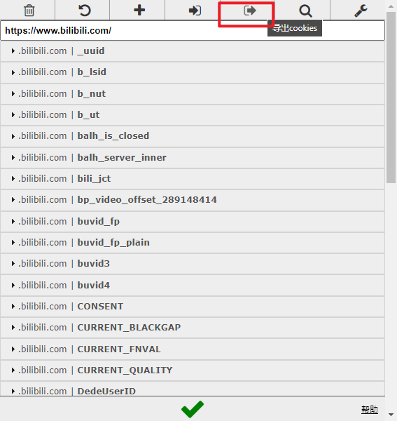
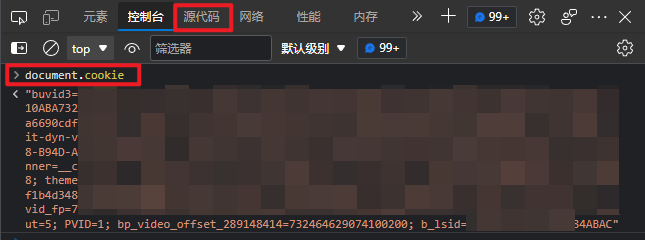

# B站舰长统计工具

### 主播用的！！！
### 主播用的！！！
### 主播用的！！！
------------
#### 需要先获取 cookies 才可以使用
------------
下载：https://github.com/cloudskytian/BiliGuard/releases
------------
## 使用方式：

直接运行即可

最多只支持半年内的记录

如果使用命令行带参数运行，带一个参数则参数为当年月份，带两个参数则参数分别为年份和月份

例：

获取2022年1月的舰长

BiliGuard.exe 2022 1

cookies 使用 json 和 文本格式 都可以，如果同时存在则优先读取 json

## 得到 json 格式 cookies 的方法：
1. Chrome 系浏览器使用扩展 EditThisCookie（需翻墙）：https://chrome.google.com/webstore/detail/editthiscookie/fngmhnnpilhplaeedifhccceomclgfbg
2. 浏览器打开B站，使用 EditThisCookie 导出 cookies 到剪切板

3. 将得到的内容并粘贴到 cookies.json

## 得到 文本格式 cookies 的方法
1. 浏览器打开B站，按 F12
2. 进入控制台，输入 document.cookie

3. 复制得到的内容并粘贴到 cookies.txt
------------
感谢 DahyunNa、芙瑞free、芙小瑞 的帮助

exe 文件由 pyinstaller 生成
