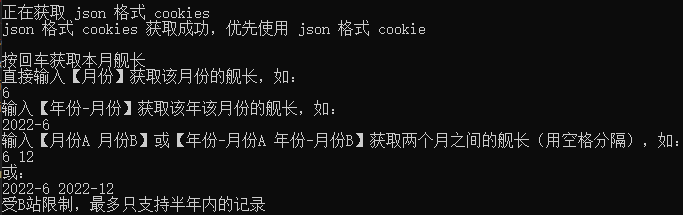
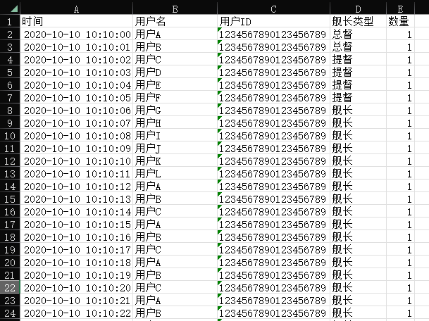

# B站舰长统计工具

### 主播用的！！！
### 主播用的！！！
### 主播用的！！！
如果只是获取当前舰长，不需要精确到具体日期，则可以使用

[【获取当前舰长】getCurrentGuards.exe](https://github.com/cloudskytian/BiliGuard/releases/latest/download/getCurrentGuards.exe)

获取当前舰长不需要cookie

------------
#### 需要先获取 cookies 才可以使用
------------
下载：https://github.com/cloudskytian/BiliGuard/releases/latest
------------
## 使用方式：

直接运行即可

受B站限制，最多只支持半年内的记录

cookies 使用 json 和 文本格式 都可以，如果同时存在则优先读取 json

## 得到 json 格式 cookies 的方法：
1. Chrome 系浏览器使用扩展 EditThisCookie（需翻墙）：https://chrome.google.com/webstore/detail/editthiscookie/fngmhnnpilhplaeedifhccceomclgfbg
2. 浏览器打开B站，使用 EditThisCookie 导出 cookies 到剪切板

3. 将得到的内容并粘贴到 cookies.json

## 得到 文本格式 cookies 的方法
1. 浏览器打开B站，按 F12
2. 进入控制台，输入 document.cookie

3. 复制得到的内容并粘贴到 cookies.txt
------------
感谢 DahyunNa、[芙瑞free](https://space.bilibili.com/1589833236)、芙小瑞 的帮助

exe 文件由 pyinstaller 生成
